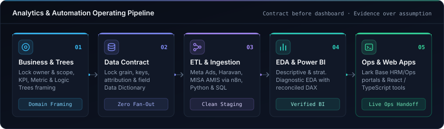

<picture>
  <source media="(prefers-color-scheme: dark)" srcset="./assets/hero-banner-dark.svg" />
  <source media="(prefers-color-scheme: light)" srcset="./assets/hero-banner-light.svg" />
  
</picture>

<picture>
  <source media="(prefers-color-scheme: dark)" srcset="./assets/github-snake-dark.svg" />
  <source media="(prefers-color-scheme: light)" srcset="./assets/github-snake.svg" />
  
</picture>

  
  
  
  

---

### About

Third-year **Data Science** undergraduate at **International University – VNU-HCM (HCMIU)** in Ho Chi Minh City, currently working as a **Business Automation & Analytics Intern** at Hebekery.

I focus on turning messy operational and marketing datasets into reliable systems teams can verify and maintain:

- **Marketing & E-Commerce Analytics** — Framing business questions into KPI, Metric, and Logic Trees, locking field-level Data Contracts and grain definitions, and auditing Meta Ads performance in **Power BI (DAX)** and **SQL**.
- **Workflow & Data Automation** — Building scheduled ingestion pipelines from **Meta Ads API**, **MISA AMIS**, and operational sheets into **Lark Base** with **n8n**, **Python**, and **REST APIs**, plus supporting relational schema design for HRM and payroll modules.
- **Internal Web Tools & Agentic Workspaces** — Building context-driven personal operating systems (`Duy AI OS`) and lightweight **TypeScript / React / Three.js** interfaces on top of Lark Base operational databases.

<picture>
  <source media="(prefers-color-scheme: dark)" srcset="./assets/pipeline-architecture-dark.svg" />
  <source media="(prefers-color-scheme: light)" srcset="./assets/pipeline-architecture-light.svg" />
  
</picture>

---

### Selected Projects

<table>
  <tr>
    <td width="50%" valign="top">
      <h4><a href="https://github.com/duytrinh-data/GET_NVL_AMIS">GET_NVL_AMIS</a></h4>
      
<strong>MISA AMIS Inventory &amp; Material Data Pipeline</strong>

      
Automated extraction and transformation utility syncing enterprise material and inventory records from MISA AMIS into structured reporting tables.

      
<code>JavaScript</code> · <code>REST API</code> · <code>ETL</code>

    </td>
    <td width="50%" valign="top">
      <h4><a href="https://github.com/duytrinh-data/neuralops-command-center">neuralops-command-center</a></h4>
      
<strong>Personal Operations &amp; Knowledge Workspace</strong>

      
Interactive web workspace combining structured document indexing, schedule tracking, health telemetry, and AI-assisted study workflows.

      
<code>TypeScript</code> · <code>React</code> · <code>Lark Base</code>

    </td>
  </tr>
  <tr>
    <td width="50%" valign="top">
      <h4><a href="https://github.com/duytrinh-data/PDM_TaskFlow">PDM_TaskFlow</a></h4>
      
<strong>Project &amp; Task Management Web App</strong>

      
Full-stack task tracking application focused on clear ownership, status transitions, and deadline visibility across team coursework.

      
<code>TypeScript</code> · <code>Full-Stack Web</code>

    </td>
    <td width="50%" valign="top">
      <h4><a href="https://github.com/duytrinh-data/rift-duel">rift-duel</a></h4>
      
<strong>Real-Time 3D Multiplayer Arena Game</strong>

      
Networked 3D platform fighter built with Three.js WebGL rendering and Colyseus authoritative multiplayer state synchronization.

      
<code>TypeScript</code> · <code>Three.js</code> · <code>Colyseus</code>

    </td>
  </tr>
  <tr>
    <td width="50%" valign="top">
      <h4><a href="https://github.com/duytrinh-data/Statistic_method">Statistic_method</a> &amp; <a href="https://github.com/duytrinh-data/coursera_project">coursera_project</a></h4>
      
<strong>Applied Statistics &amp; Analytical T-SQL</strong>

      
HCMIU statistical inference and regression notebooks alongside relational modeling, CTE, and window-function SQL query patterns.

      
<code>Python</code> · <code>Jupyter</code> · <code>T-SQL</code>

    </td>
    <td width="50%" valign="top">
      <h4><a href="https://github.com/duytrinh-data/pdf-to-markdown">pdf-to-markdown</a></h4>
      
<strong>Structured Document-to-Markdown Utility</strong>

      
Lightweight converter turning PDFs and office documents into clean Markdown context for indexing and analytical review.

      
<code>HTML</code> · <code>JavaScript</code> · <code>Markdown</code>

    </td>
  </tr>
</table>

---

### Stack & Tooling

<table>
  <tr>
    <td width="33%" valign="top">
      <h4>Data Science &amp; BI</h4>
      

        
        
        
        
        
      

      Data Dictionary design, grain &amp; attribution locking, and formula reconciliation prior to BI visualization.
    </td>
    <td width="33%" valign="top">
      <h4>Automation &amp; Ops</h4>
      

        
        
        
        
        
      

      Scheduled API ingestion, HRM &amp; payroll relational schema design, lookup/formula automation.
    </td>
    <td width="34%" valign="top">
      <h4>Application Engineering</h4>
      

        
        
        
        
        
      

      Internal operational web portals, real-time 3D web apps, and Data Science coursework at HCMIU.
    </td>
  </tr>
</table>

---

### How I Work

| Principle | Practice |
| :--- | :--- |
| **1. Contract Before Dashboard** | Clarify the business question, owner, table grain, and key relationships before writing DAX or building visuals. |
| **2. Evidence Over Assumption** | Separate system-verified numbers from domain-owner rules and analytical hypotheses; verify totals against source exports. |
| **3. Human-in-the-Loop AI** | Use AI agents and MCP tooling to speed up implementation while keeping explicit human checks on input definitions, logic, and failure modes. |

---

Trịnh Đình Duy (@duytrinh-data) · Ho Chi Minh City, Vietnam · <a href="mailto:trinhdinhduy1206@gmail.com">trinhdinhduy1206@gmail.com</a>
